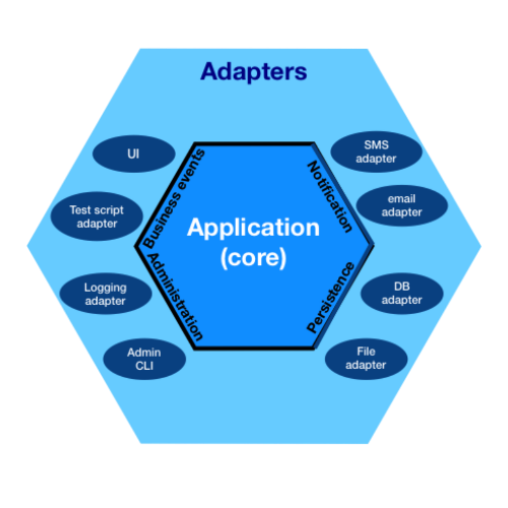

## Arquitetura Hexagonal

The hexagonal architecture, or ports and adapters architecture, is an architectural pattern used in software design. It aims at creating loosely coupled application components that can be easily connected to their software environment by means of ports and adapters. This makes components exchangeable at any level and facilitates test automation.

The term "hexagonal" comes from the graphical conventions that shows the application component like a hexagonal cell. The purpose was not to suggest that there would be six borders/ports, but to leave enough space to represent the different interfaces needed between the component and the external world.

The hexagonal architecture divides a system into several loosely-coupled interchangeable components, such as the application core, the database, the user interface, test scripts and interfaces with other systems. This approach is an alternative to the traditional layered architecture.

